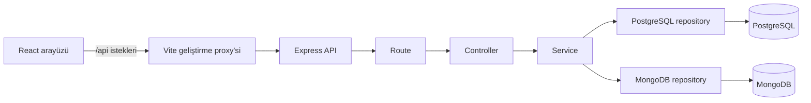

# Kişisel Kitaplık ve Okuma Günlüğü

Kişisel Kitaplık ve Okuma Günlüğü; yazarları, kitapları ve kitaplara bağlı okuma notlarını yönetmek için geliştirilmiş, yerel ortamda çalışan tek kullanıcılı bir eğitim uygulamasıdır.

Projenin temel amacı React, Express, PostgreSQL ve MongoDB'nin aynı uygulamada hangi sorumlulukları üstlendiğini göstermektir. Tarayıcı veritabanlarına doğrudan bağlanmaz; bütün veri işlemleri backend API'si üzerinden yapılır.

## Kullanılan teknolojiler

- JavaScript
- React ve Vite
- Node.js ve Express
- PostgreSQL ve `pg`
- MongoDB ve resmi `mongodb` sürücüsü
- ES Modules
- npm

## Mevcut özellikler

- Yazar ekleme, listeleme, düzenleme ve silme
- Kitap ekleme, listeleme, düzenleme ve silme
- Kitap adına göre büyük/küçük harf duyarsız arama
- Okuma durumuna göre filtreleme
- Kitap listesinde sayfalama
- Kitap ve yazar formlarında yüklenme, hata ve başarı bildirimleri
- Kitaplara bağlı not ve alıntılar için backend CRUD endpoint'leri
- Günlük kaydı bulunan kitabın silinmesini engelleme
- Bağlı kitabı bulunan yazarın silinmesini PostgreSQL foreign key ile engelleme
- MongoDB erişilemiyorsa kitabı silmeden `503 Service Unavailable` döndürme

React arayüzünde şu anda **Kitaplığım** ve **Yazarlar** ekranları bulunur. Okuma günlüğü backend tarafından desteklenir; günlük kayıtlarını yöneten React ekranı henüz eklenmemiştir.

## Mimari ve veri akışı

Backend şu katmanları kullanır:

```text
route → controller → service → repository → veritabanı
```

- **Route:** HTTP yöntemi ile URL'yi doğru controller fonksiyonuna bağlar.
- **Controller:** İstek verisini alır, service fonksiyonunu çağırır ve HTTP yanıtını oluşturur.
- **Service:** Doğrulama ve iş kurallarını uygular.
- **Repository:** Parametreli SQL sorgularını veya kontrollü MongoDB işlemlerini çalıştırır.



## Verilerin saklandığı yerler

### PostgreSQL

İlişkisel ve yapısal veriler PostgreSQL'de tutulur:

- `authors`: yazarlar
- `books`: kitaplar
- `schema_migrations`: uygulanmış migration dosyaları

Her kitap tek bir yazara bağlıdır. `books.author_id`, `authors.id` alanını foreign key ile referans eder.

Kitap durumları:

- `to_read`
- `reading`
- `completed`

Kitap ve yazar kimlikleri uygulamanın ürettiği UUID değerleridir.

### MongoDB

Değişken yapıda büyüyebilecek okuma günlüğü kayıtları MongoDB'deki `reading_entries` koleksiyonunda tutulur.

Bir günlük belgesinde şu alanlar bulunur:

- `_id`: MongoDB tarafından kullanılan `ObjectId`
- `bookId`: PostgreSQL kitap UUID'sinin metin hali
- `type`: `note` veya `quote`
- `content`: boş olmayan günlük metni
- `page`: isteğe bağlı pozitif tam sayı
- `tags`: metin dizisi
- `createdAt` ve `updatedAt`: BSON Date

`bookId` alanında bir MongoDB indeksi bulunur.

## Proje yapısı

```text
DB-Task-1/
├── README.md
├── client/
│   ├── src/
│   │   ├── components/
│   │   │   └── BookForm.jsx
│   │   ├── pages/
│   │   │   ├── AuthorsPage.jsx
│   │   │   └── LibraryPage.jsx
│   │   ├── services/
│   │   │   ├── api.js
│   │   │   ├── authorsService.js
│   │   │   └── booksService.js
│   │   ├── App.jsx
│   │   ├── main.jsx
│   │   └── styles.css
│   ├── index.html
│   ├── package.json
│   └── vite.config.js
└── server/
    ├── src/
    │   ├── controllers/
    │   ├── db/
    │   │   └── migrations/
    │   ├── errors/
    │   ├── middleware/
    │   ├── repositories/
    │   ├── routes/
    │   ├── services/
    │   ├── app.js
    │   └── server.js
    ├── .env.example
    └── package.json
```

## Gereksinimler

Uygulamayı çalıştırmadan önce şunların kurulu olması gerekir:

- Node.js
- npm
- PostgreSQL
- MongoDB Community Server veya erişilebilir başka bir MongoDB sunucusu

Sürümleri PowerShell'de kontrol edebilirsin:

```powershell
node --version
npm --version
```

Yerel veritabanı servislerini kontrol etmek için:

```powershell
Get-Service MongoDB,postgresql-x64-18
```

Servis adları kurulu PostgreSQL sürümüne göre farklı olabilir.

## Kurulum

### 1. PostgreSQL veritabanını oluştur

Backend tabloları migration ile oluşturur ancak PostgreSQL veritabanının önceden var olması gerekir. `personal_library` veritabanı henüz yoksa pgAdmin üzerinden oluşturabilir veya `psql` kullanabilirsin:

```powershell
psql -U postgres -c 'CREATE DATABASE personal_library;'
```

Mevcut bir veritabanını silme veya sıfırlama işlemi gerekmez.

### 2. Backend ortam dosyasını hazırla

Backend dizinine geç:

```powershell
cd C:\Users\oataf\Documents\Codex\2026-08-24\new-chat\outputs\quiz-sinav-react\02\DB-Task-1\server
Copy-Item .env.example .env
```

`.env` dosyasındaki örnek değerleri kendi yerel bağlantı bilgilerine göre düzenle:

```dotenv
HOST=127.0.0.1
PORT=3001

PGHOST=127.0.0.1
PGPORT=5432
PGDATABASE=personal_library
PGUSER=postgres
PGPASSWORD=yerel_postgresql_parolan
PGSSL=false

MONGODB_URI=mongodb://127.0.0.1:27017
MONGODB_DATABASE=personal_library
```

Gerçek parolayı `.env.example` dosyasına veya frontend ortam değişkenlerine yazma. `.env` Git tarafından takip edilmez.

### 3. Bağımlılıkları kur

Backend bağımlılıkları:

```powershell
cd C:\Users\oataf\Documents\Codex\2026-08-24\new-chat\outputs\quiz-sinav-react\02\DB-Task-1\server
npm install
```

Frontend bağımlılıkları:

```powershell
cd C:\Users\oataf\Documents\Codex\2026-08-24\new-chat\outputs\quiz-sinav-react\02\DB-Task-1\client
npm install
```

### 4. Migration'ı uygula

```powershell
cd C:\Users\oataf\Documents\Codex\2026-08-24\new-chat\outputs\quiz-sinav-react\02\DB-Task-1\server
npm run db:migrate
```

Migration dosyaları numaralıdır ve uygulanmış dosyalar `schema_migrations` tablosunda takip edilir. Sunucu başlangıcında migration kontrol edilir; tablolar silinip yeniden oluşturulmaz.

## Uygulamayı çalıştırma

Backend ve frontend ayrı geliştirme sunucularıdır. İkisini iki ayrı PowerShell terminalinde açık tutmalısın.

### Terminal 1: backend

```powershell
cd C:\Users\oataf\Documents\Codex\2026-08-24\new-chat\outputs\quiz-sinav-react\02\DB-Task-1\server
npm run dev
```

Beklenen çıktı:

```text
Server is running on http://127.0.0.1:3001
```

Uygulamanın ayakta olduğunu kontrol etmek için:

```text
http://127.0.0.1:3001/api/health
```

Beklenen yanıt:

```json
{"status":"ok"}
```

Bu health endpoint'i yalnızca Express uygulamasının çalıştığını gösterir; veritabanlarının durumunu doğruladığını iddia etmez.

### Terminal 2: frontend

```powershell
cd C:\Users\oataf\Documents\Codex\2026-08-24\new-chat\outputs\quiz-sinav-react\02\DB-Task-1\client
npm run dev
```

Beklenen çıktı:

```text
Local: http://127.0.0.1:5173/
```

Tarayıcıda şu adresi aç:

```text
http://127.0.0.1:5173/
```

Vite, geliştirme sırasında `/api` ile başlayan frontend isteklerini `http://127.0.0.1:3001` adresindeki backend'e aktarır.

## Arayüzün kullanımı

### Yazar ekleme

1. Üst menüden **Yazarlar** ekranını aç.
2. Yazar adını gir.
3. **Yazarı kaydet** düğmesine bas.
4. Başarı mesajını ve yeni yazarı listede gör.

Bir yazarı değiştirmek için **Düzenle**, silmek için **Sil** düğmesini kullan. Yazara bağlı kitap varsa backend `409 Conflict` döndürür ve arayüz önce bağlı kitapların silinmesi gerektiğini açıklar.

### Kitap ekleme

1. Önce en az bir yazar oluştur.
2. **Kitaplığım** ekranını aç.
3. **Kitap ekle** düğmesine bas.
4. Kitap adı, yazar ve okuma durumunu seç.
5. **Kitabı kaydet** düğmesine bas.

Yazar seçenekleri backend API'sinden alınır. Form gönderilirken düğme devre dışı bırakılır; böylece aynı istek tekrar gönderilmez.

### Arama, filtreleme ve sayfalama

- Arama alanına kitabın adının tamamını veya bir bölümünü yazıp **Ara** düğmesine bas.
- Durum listesinden **Okunacak**, **Okunuyor** veya **Tamamlandı** seç.
- Filtreleri kaldırmak için **Filtreleri temizle** düğmesini kullan.
- Birden fazla sayfa varsa **Önceki** ve **Sonraki** düğmeleri görünür.

## Veritabanı bağlantılarını doğrulama

PostgreSQL bağlantısını ve tablo yapısını kontrol et:

```powershell
cd C:\Users\oataf\Documents\Codex\2026-08-24\new-chat\outputs\quiz-sinav-react\02\DB-Task-1\server
npm run db:verify
```

MongoDB bağlantısını ve `bookId` indeksini kontrol et:

```powershell
npm run mongo:verify
```

## Frontend üretim derlemesi

React uygulamasının üretim derlemesini kontrol etmek için:

```powershell
cd C:\Users\oataf\Documents\Codex\2026-08-24\new-chat\outputs\quiz-sinav-react\02\DB-Task-1\client
npm run build
```

Derleme çıktısı `client/dist` altında oluşur.

## API endpoint'leri

### Uygulama durumu

| Yöntem | Endpoint | Açıklama |
| --- | --- | --- |
| GET | `/api/health` | Express uygulamasının çalıştığını gösterir |

### Yazarlar

| Yöntem | Endpoint | Açıklama |
| --- | --- | --- |
| POST | `/api/authors` | Yazar oluşturur |
| GET | `/api/authors` | Yazarları listeler |
| GET | `/api/authors/:id` | Yazarı getirir |
| PATCH | `/api/authors/:id` | Yazarın adını günceller |
| DELETE | `/api/authors/:id` | Yazarı siler |

### Kitaplar

| Yöntem | Endpoint | Açıklama |
| --- | --- | --- |
| POST | `/api/books` | Kitap oluşturur |
| GET | `/api/books` | Kitapları listeler |
| GET | `/api/books/:id` | Kitap detayını getirir |
| PATCH | `/api/books/:id` | Kitabı günceller |
| DELETE | `/api/books/:id` | Günlük kontrolünden sonra kitabı siler |

Kitap listesi sorgu parametreleri:

```text
GET /api/books?title=martin&status=reading&page=1&limit=20
```

`limit` en fazla `100` olabilir.

### Okuma günlüğü

| Yöntem | Endpoint | Açıklama |
| --- | --- | --- |
| POST | `/api/books/:bookId/entries` | Günlük kaydı oluşturur |
| GET | `/api/books/:bookId/entries` | Kitabın günlük kayıtlarını listeler |
| GET | `/api/books/:bookId/entries/:entryId` | Tek günlük kaydını getirir |
| PATCH | `/api/books/:bookId/entries/:entryId` | Günlük kaydını günceller |
| DELETE | `/api/books/:bookId/entries/:entryId` | Günlük kaydını siler |

Tekil günlük sorguları hem MongoDB `_id` değerini hem PostgreSQL kitap UUID'sinin metin hali olan `bookId` değerini kullanır. Böylece başka kitaba ait bir kayıt yanlış URL üzerinden değiştirilemez.

## API yanıt biçimleri

Başarılı tek kayıt:

```json
{
  "data": {}
}
```

Başarılı liste:

```json
{
  "data": []
}
```

Hata:

```json
{
  "error": {
    "code": "ERROR_CODE",
    "message": "Anlaşılır hata mesajı"
  }
}
```

Başarılı silme yanıtı `204 No Content` durum kodunu ve boş gövdeyi kullanır.

## İki veritabanı arasındaki tutarlılık sınırı

Bir kitap silinirken backend önce MongoDB'deki `reading_entries` koleksiyonunda kitabın UUID metnini taşıyan bir `bookId` belgesi arar. Kayıt varsa kitap silinmez ve istemciye önce günlük kayıtlarını silmesini söyleyen `409 Conflict` yanıtı verilir. MongoDB'ye erişilemiyorsa kontrol tamamlanmış sayılmaz; PostgreSQL'deki kitap silinmeden `503 Service Unavailable` döner. Yazar silme işlemi ise PostgreSQL'deki `books.author_id` foreign key ve `ON DELETE RESTRICT` kuralıyla korunur.

MongoDB sorgusunun kayıt bulamayıp `null` döndürmesi bir bağlantı hatası değildir. `null`, kitabın günlük kaydı bulunmadığını gösterir ve silme devam edebilir. Bağlantı veya sunucu seçimi hatasında ise kontrol yapılamadığı için silme durdurulur.

PostgreSQL ile MongoDB arasında ortak foreign key veya ortak transaction yoktur. Bu nedenle "MongoDB'de kontrol et, ardından PostgreSQL'de sil" akışı atomik değildir. Eşzamanlı iki istekte, MongoDB kontrolü bittikten sonra PostgreSQL silme işlemi gerçekleşmeden hemen önce aynı kitaba yeni bir günlük kaydı eklenebilir. Böyle bir yarış koşulu MongoDB'de artık var olmayan bir PostgreSQL kitabını gösteren kayıt bırakabilir.

Yerel eğitim sürümü bu sınırı bilinçli olarak kabul eder. Dağıtık transaction, cache veya mesaj kuyruğu altyapısı bu sürümün kapsamına eklenmemiştir.

## Kapsam dışı özellikler

- Kullanıcı hesabı ve giriş sistemi
- Yetkilendirme
- Mikroservis mimarisi
- Cache
- Mesaj kuyruğu
- Dağıtık transaction
- Frontend okuma günlüğü ekranı
